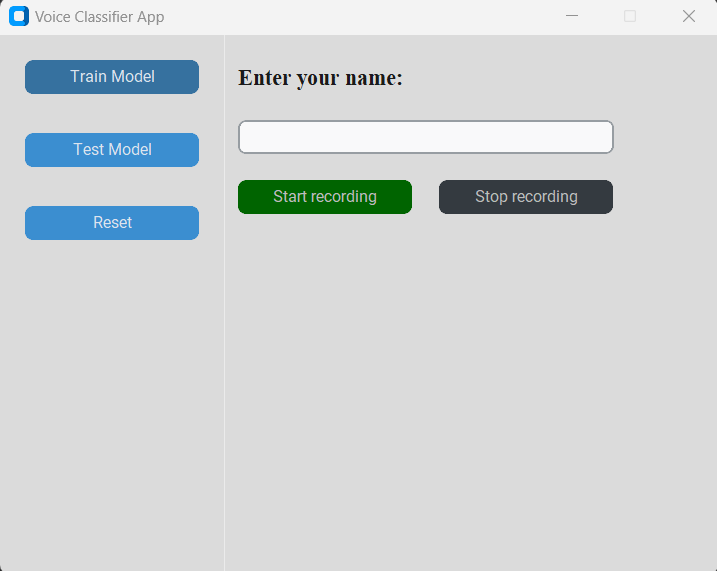

## Voice Classifier

The project is designed to train a machine learning model on voice data and predict the speaker when given a new audio sample. It includes components for data preprocessing, model training, and real-time inference.

## Project Structure

The project is organized into several components:

- **ml_scripts:** Contains the main functionality, including the CNN architecture, dataset handling, and utilities.
- **train.py:** Script for training the machine learning model.
- **inference.py:** Script for making predictions on new audio samples.
- **AppDataset.py:** Dataset class for loading and preprocessing audio data.
- **cnn.py:** Definition of the CNN architecture.
- **utils.py:** Utility functions for file paths, logging, and data manipulation.
- **augmentation:** Contains functions to perform data augmentation on audio files

